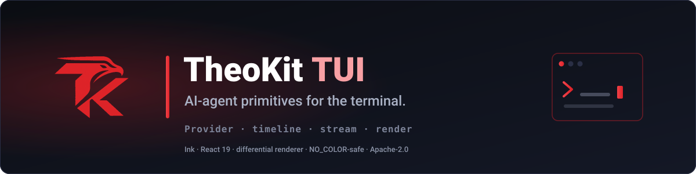

<p align="center">
  
</p>

# theokit-tui

Workspace for [`@theokit/tui`](./packages/tui) — AI-agent terminal UI primitives for
agent CLIs, built on Ink (React for the terminal).

**The package documentation lives in [`packages/tui/README.md`](./packages/tui/README.md).**
That is the file npm publishes; this one describes the repository around it.

## Layout

```
packages/tui/     the published package — src, tests, examples, benchmarks
assets/           brand artwork
wiki/             the OKF knowledge bundle: parity gates, benchmarks, decisions
CHANGELOG.md      the single changelog, and the source of the next version
```

One package, one workspace. The workspace shape is shared with the rest of the Theo
framework (`theokit-sdk`) so a contributor moving between repositories finds the same
tree, the same `biome.json`, and the same `.ls-lint.yml` rules.

## Gates

```bash
corepack enable && corepack prepare pnpm@10.34.1 --activate
pnpm install --frozen-lockfile
pnpm gates    # format:check + validate:naming + lint + typecheck + depcruise + build + test
```

`pnpm gates` is what CI runs. Contribution rules, branch model and test conventions are
in [CONTRIBUTING.md](./CONTRIBUTING.md); security reporting is in [SECURITY.md](./SECURITY.md).

## License

Apache-2.0
