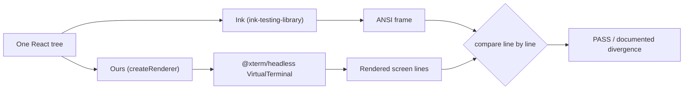

# The method

The **same React element** is rendered through two hosts and the results are
compared:

Two properties make this a gate rather than a snapshot:

- **The comparison basis is the screen, not the byte stream.** An independent
  emulator reads back what a terminal would actually show. Ink's SGR ordering
  differs from our normalized cell-grid readback, so comparing raw ANSI would
  fail on encoding rather than on appearance.[^m20-report]
- **Silence fails.** A divergence is acceptable only if it appears in the
  milestone report _with a verdict_; an undocumented divergence fails CI.[^m17-report]

# Why not diff the existing snapshots

The M18 Definition of Done said "≥ 90% of the existing component snapshot corpus
passes unchanged". The 40 `.snap` files are **Ink-rendered ANSI frames** — they
bake in Ink's exact escape ordering and cannot be diffed against our readback.
The gate was re-scoped to a screen-comparison proxy over 14 representative
scenes: **stronger per scene** (it compares what the terminal shows, via an
independent emulator) though narrower in count, with a vacuity guard asserting
non-empty output on both sides.[^m18-report]

# Layers of the gate

| Layer                | Where                                                            | What it asserts                                                             |
| -------------------- | ---------------------------------------------------------------- | --------------------------------------------------------------------------- |
| Skeleton scene       | `src/renderer/renderer.test.tsx › parity_with_ink_on_text_scene` | Plain column/row text is line-identical.[^m17-report]                       |
| Layout corpus        | `tests/renderer/parity-corpus.test.tsx`                          | 14 scenes (primitives + 7 real components), plain-text layout.[^m18-report] |
| SGR bytes            | `sgr_color_bytes_match_ink`                                      | The coloured cell grid is byte-identical to Ink.[^m18-report]               |
| Full component suite | `tests/renderer/component-parity.test.tsx`                       | All 16 shipped components, incl. `Static` scrollback.[^m20-report]          |

SGR is _stripped_ in the layout layers deliberately, to isolate layout from
colour; colour is asserted separately, and holds by construction because both
engines share Ink's chalk transform and `@alcalzone/ansi-tokenize`.[^m18-report]

# Results

- [M17](/renderer/m17-skeleton-parity.md) — skeleton scene identical; the wider
  surface deferred with per-row verdicts.
- [M18](/renderer/m18-layout-parity.md) — 14/14 under real Yoga.
- [M20](/renderer/m20-component-parity.md) — 16/16 components, 0 divergences.

The gate exists because the engine it verifies is a rewrite; see
[Differential renderer](/concepts/differential-renderer.md).

[^m17-report]: M17 parity report, § header and § Known divergences.

[^m18-report]: M18 layout parity report, § On the DoD wording and § Still deferred.

[^m20-report]: M20 component parity report, § Method and § Caveats.
